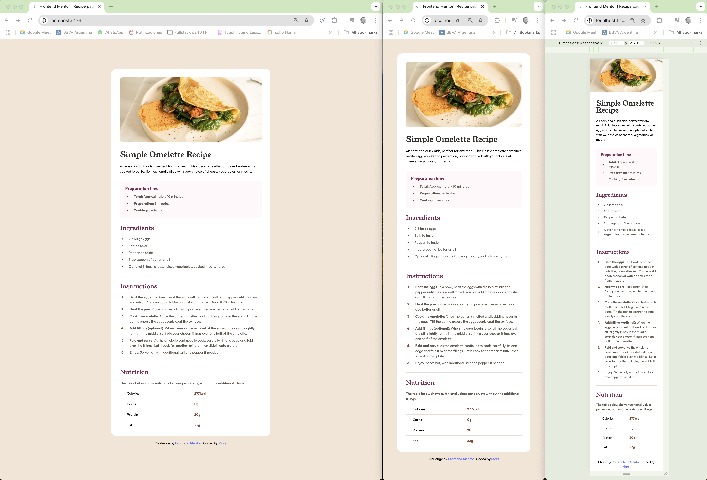

# Frontend Mentor - Recipe page solution

This is a solution to the [Recipe page challenge on Frontend Mentor](https://www.frontendmentor.io/challenges/recipe-page-KiTsR8QQKm). Frontend Mentor challenges help you improve your coding skills by building realistic projects.

## Table of contents

- [Overview](#overview)
  - [Screenshot](#screenshot)
  - [Links](#links)
- [My process](#my-process)
  - [Built with](#built-with)
  - [What I learned](#what-i-learned)
- [Author](#author)

## Overview

### Screenshot



### Links

- Live Site URL: [Recipe Page](https://martinianol.github.io/recipe-page/)

## My process

### Built with

- Semantic HTML5 markup
- CSS custom properties
- Flexbox
- Mobile-first workflow
- [Vite](https://vite.dev/) - Vite
- [React](https://reactjs.org/) - JS library
- [Styled Components](https://styled-components.com/) - For styles

### What I learned

Through this project, I deepened my understanding of modern frontend development with Vite and React, focusing on responsive design, component structuring, and best practices with styled-components. I learned how to dynamically style elements based on props, manage layout centering across different screen sizes, and refine typography for different viewports.

A key takeaway was mastering unordered (ul) and ordered (ol) lists, where I explored customizing bullet points, controlling spacing, and using ::marker and ::before for full styling flexibility.

I also gained valuable experience working with a theme and ThemeProvider, allowing me to maintain a consistent color palette, typography, and global styles throughout the application. This approach not only improved maintainability but also made it easier to adapt styles dynamically based on different states and themes.

Finally, I gained hands-on experience deploying a Vite app to GitHub Pages, troubleshooting Git issues, and optimizing assets for a clean, maintainable project. This journey helped me refine my workflow and strengthened my ability to build scalable, production-ready applications. 🚀🔥

```jsx
export const List = styled.ul`
  display: flex;
  flex-direction: column;
  gap: 8px;
  ${({ theme }) => theme.typography["text-preset-4"]}
  color: ${({ theme }) => theme.colors.stone[600]};
  list-style-position: inside;
  list-style: none;
`;

export const ListItem = styled.li`
  position: relative;
  padding-left: 40px;
`;

export const ListItemWithCustomBullet = styled(ListItem)`
  &::before {
    content: "•";
    font-size: 24px;
    position: absolute;
    left: 8px;
    top: 50%;
    transform: translateY(-50%);
    color: ${({ theme }) => theme.colors.rose[800]};
  }
`;
```

## Author

- Github - [Mars](https://github.com/martinianol)
- Frontend Mentor - [martinianol](https://www.frontendmentor.io/profile/martinianol)
- LinkedIn - [Martiniano Leguizamon](https://www.linkedin.com/in/martinianol/)
